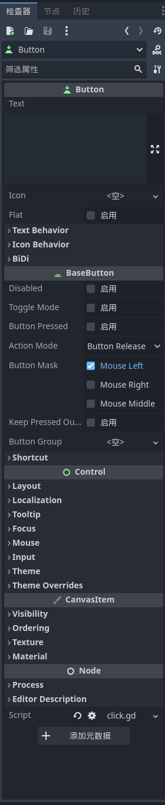

**节点(Node)** 是Godot中的基本单位。

> 众所周知Node是并不存在的。它从未存在，现在不存在，将来也不会存在于这个宇宙位元的任何一处。
> 它就像这个世界的镜像一般可见而不可触及，正如光与影、正与负、阳与阴一般，相互依存而不可归一。
> 它的自我保护机能让它远离一切可能的危害以避免湮灭，然而其必然存在的邪恶念头并不反对将某些玩物引入来取得奇怪的恶趣味。
> 这也是Godot引入Node的原因。

>下面是Github Copilot给出的解释：
>Node是一个抽象的概念，它可以是一个2D或3D的对象，也可以是一个UI控件，甚至可以是一个脚本。Node可以包含其他Node，这样就形成了一个树形结构。这个树形结构就是Godot的场景。

实际上，Node就是一个对象，它包含了一些变量和函数，每一帧根据给定的代码产生一定的变化，显示在屏幕上，组成了我们所看到的游戏画面。

我们可以在Godot右侧看到选中的Node的属性。

从图中可以看出，该节点名为Button，继承关系为`Node -> CanvasItem -> Control -> BaseButton -> Button`。每一个父类中都有可以调节的参数。最后一行的`Script`显示了这个节点绑定的脚本。在图片中，绑定的脚本是`click.gd`。最下角有一个“添加元数据”按钮，点击后可以添加自定义的元数据（相当于给这个类添加一个变量成员）。

游戏运行时修改Node中的属性一般有以下几种方法：

1. 挂载脚本，通过脚本中的代码控制。
2. 在其他脚本中通过`get_node`函数获取节点，再读取或写入节点的属性。

