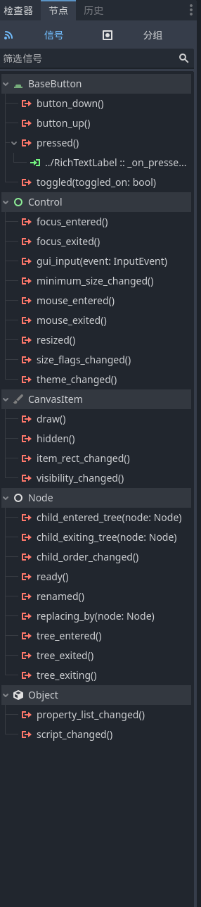
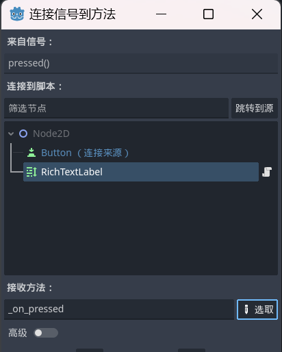

先上[官方文档](https://docs.godotengine.org/zh-cn/4.x/getting_started/step_by_step/signals.html)

> 信号是 Godot 内置的委派机制，允许一个游戏对象对另一个游戏对象的变化做出反应，而无需相互引用。使用信号可以限制耦合，并保持代码的灵活性。

本文档中，在[GDScript的介绍](./language.md#23)中的第23点已经提到了信号的使用，这里再详细介绍一下。

信号可以被其他函数连接，当信号被发射时，所有的函数都会被调用。这种机制可以用来实现[观察者模式](https://zh.wikipedia.org/wiki/%E8%A7%82%E5%AF%9F%E8%80%85%E6%A8%A1%E5%BC%8F)。

很多节点（如Button）都提供了预定义的信号，可以在右侧的Inspector中查看。



双击信号选择一个挂载到任意节点的脚本中的函数，就可以将信号连接到这个函数。



这样，当信号被发射时，这个函数就会被调用。

可以在代码中使用`connect`函数来连接信号：

```gdscript
func _ready():
    button_node = get_node("../Button")
    button_node.pressed.connect(_on_Button_pressed)

func _on_Button_pressed():
    print("Button pressed")
```

如果这个脚本被挂载到与Button同级的节点上，那么这个代码就会将Button的`pressed`信号连接到`_on_Button_pressed`函数上。这样，当Button被按下时，`_on_Button_pressed`函数就会被调用，打印出`Button pressed`。

信号是可以自定义的，可以在脚本中使用`signal`关键字来定义信号：

```gdscript
signal health_depleted
```

这个脚本被挂载到任意节点上后，可以在Godot编辑器中右侧的Inspector中看到这个信号。可以与预定义的信号一样，在Godot编辑器中或者代码中连接这个信号。


信号可以带参数，这样连接的函数就可以接收这些参数：

```gdscript
signal health_changed(old_health: int, new_health: int)
```

带参数的信号所连接的函数也要带相同的参数。

信号可以在代码中使用`emit`函数来发射：

```gdscript
health_changed.emit(100, 50)
```

`emit`是信号的一个成员函数，它接收任意数量的参数，不过最好和信号定义时的参数一致。

